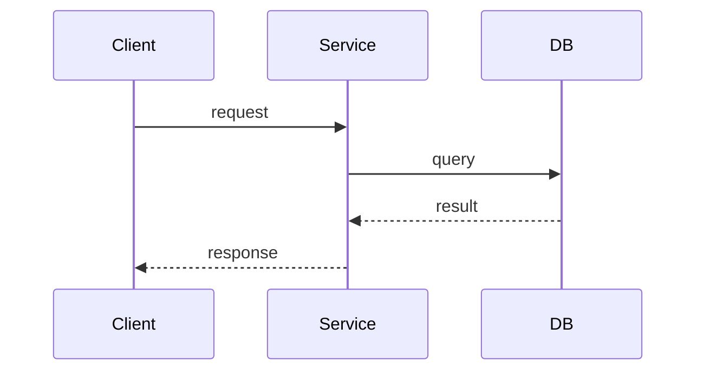

# Design Template

```markdown
# <Feature Name> — Design
> Status: draft

## Approach
2-3 sentences: the high-level strategy and why.

## Components
For each component involved:

### <Component Name>
- **Responsibility**: one sentence
- **Interface**: public methods/endpoints/messages
- **Dependencies**: what it talks to

## Data flow
How data moves through the system for the primary use case. For a simple, linear
flow, a few sentences or a short list is enough. Add a diagram ONLY when the logic
is complex or a dependency/flow is non-obvious (branching, concurrency, multi-component
interaction, state machine). Use Mermaid inline; for complex visualizations reference
an image from the `diagrams/` folder instead.



## Schema changes
New tables/fields, migrations, index considerations.
(Omit if no persistence changes.)

## API changes
New/modified endpoints with request/response shapes.
(Omit if no API changes.)

## Metrics
New or changed metrics introduced by this feature.
- `metric_name` — what it tracks (type: counter/histogram/gauge)
(Omit if no metrics changes.)

## Alternatives considered
- **Option A (chosen)**: what and why
- **Option B (rejected)**: what and why not
(If significant exploration happened, capture details in `research.md`.)

## Risks
What could go wrong. How we mitigate or accept it.
```

## Guidance

- **Keep it short — 40-80 lines is typical.** This is a lightweight workflow;
  capture decisions and boundaries, not an exhaustive spec. Skip sections that
  don't apply instead of filling them with "N/A".
- **Diagrams only when they earn it.** Draw a diagram only for complex logic or a
  non-obvious dependency/flow — branching, concurrency, multi-component interaction,
  state machines. A simple request→service→DB→response path is prose, not a diagram.
  Use Mermaid inline; for large or complex visuals, place a `.drawio` file and an
  exported `.png`/`.svg` in `diagrams/` and reference the image here.
- Describe logic in pseudo-code or plain language — full code snippets only when
  ambiguity would remain without them.
- Include at least one rejected alternative for each significant decision.
  This saves future readers from re-exploring dead ends.
- Small features get small design docs. Don't inflate.
