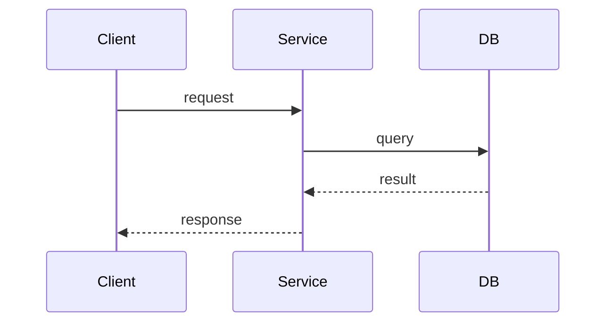

# Design Template

```markdown
# <Feature Name> — Design
> Status: draft

## Approach
2-3 sentences: the high-level strategy and why.

## Components
For each component involved:

### <Component Name>
- **Responsibility**: one sentence
- **Interface**: public methods/endpoints/messages
- **Dependencies**: what it talks to

## Data flow
How data moves through the system for the primary use case.
Prefer a Mermaid diagram (sequence or flowchart). For complex visualizations, reference
an image from the `diagrams/` folder instead.



## Schema changes
New tables/fields, migrations, index considerations.
(Omit if no persistence changes.)

## API changes
New/modified endpoints with request/response shapes.
(Omit if no API changes.)

## Metrics
New or changed metrics introduced by this feature.
- `metric_name` — what it tracks (type: counter/histogram/gauge)
(Omit if no metrics changes.)

## Alternatives considered
- **Option A (chosen)**: what and why
- **Option B (rejected)**: what and why not
(If significant exploration happened, capture details in `research.md`.)

## Risks
What could go wrong. How we mitigate or accept it.
```

## Guidance

- Use Mermaid for inline diagrams. For large or complex visuals, place a `.drawio`
  file and an exported `.png`/`.svg` in `diagrams/` and reference the image here.
- Describe logic in pseudo-code or plain language — full code snippets only when
  ambiguity would remain without them.
- Include at least one rejected alternative for each significant decision.
  This saves future readers from re-exploring dead ends.
- Small features get small design docs. Don't inflate.
